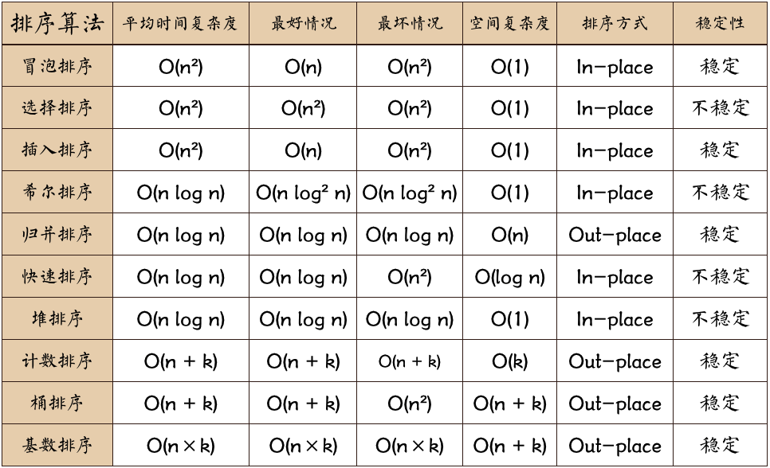

## 算法
Java实现常见的排序算法

### 排序的稳定性
因为待排序的记录序列中可能存在两个或两个以上的关键字相等的记录， 排序结果可能会存在不唯一的情况。所以就有稳定与不稳定的定义。

假设ki=kj( 1 =< i <= n,1 =< j <= n, i != j)，且在排序前的序列中ri领先于rj。
如果排序后ri仍领先于rj，则称所用的排序方法是稳定的；反之，若可能使得排序后的序列中rj领先于
ri，则称所用的排序方法是不稳定的。
只要有一组关键字发生类似情况，就可认为此排序方法是不稳定的。

### 内排序和外排序
根据在排序过程中待排序记录是否全部放在内存中，排序分为内排序和外排序。

* 内排序是在排序整个过程中，待排序的所有记录全部被放置在内存中。

* 外排序是由于排序的记录个数太多，不能同时放置在内存中，整个排序过程需要在内外存之间多次交换数据才能进行。

* 对内排序来说，排序算法的性能主要有3个影响因素：

1. 时间性能
排序算法的时间开销是衡量其好坏的最重要的标志。
在内排序中，主要进行两种操作：比较和移动。
高效率的内排序算法应该具有尽可能少的关键字比较次数和尽可能少的记录移动次数。
2. 辅助空间
评估算法的另一个主要标准是执行算法所需要的辅助存储空间。
辅助存储空间是除了存放待排序所占用的存储空间外，执行算法所需要的其他存储空间。
3. 算法的复杂性
指算法本身的复杂性，过于复杂的算法也会影响排序的性能。

常见算法复杂度如图：

